---

---

# Portfolio Website: Niraj Amatya

------

### Links 

Deployed Website:  https://niraj-amatya.github.io/

Github Address: https://github.com/Niraj-Amatya

------

## Purpose

This is my protfolio website and the purpose of this website is to demonstrate my technical skills in designing and development. Desigining  a website takes time and it needs proper planning and documentation. This website will  show my project planning ability to perform any task. It demonstrates my capabilities to plan, design, implement and deploy a website.

This will improve my exposure to others in the industry.  Potential employer will be able to know a little bit about myself through this website. More than that it is also a way to utilise my skills that I have learned so far (HTML, CSS, SASS and Git) by using them in this website.

## Functationality and Features

The website was built with simplicty and cleanness in mind, so that there is less distraction for the users. However, I have  used some features  to engage the user and make it easier to navigate.

### 1. Navigation Bar

Navigation bar is used in top of every page of the website. Users can navigate to other pages like home,     projects, about and contact page through navigation bar, since it will have link to all other pages. A blue hover effect is used to better guide the user and also tell the user that the feature is interactable. 

The navigation bar also inform visiotors about the all th pages they will be able to visit.

### 2. Sticky navgation bar

Sticky navigation bar is used so that even the pages go longer in the future as more contents are added, user will not get lost. And they will always find the way to return to their desired page through navigation bar as it stays where it is and does not get lost with scrolling. 

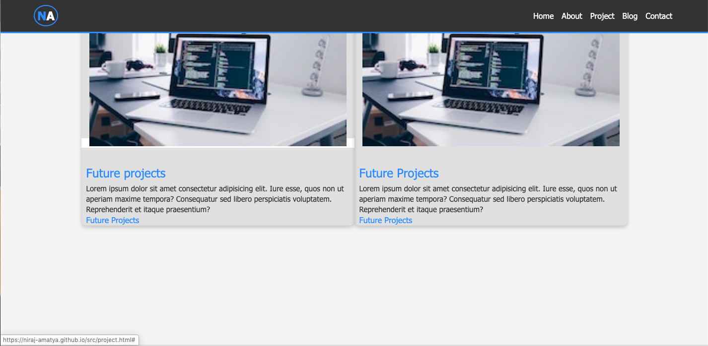

### 3. Skill bar

Skill bar is used to show my skills in different programming languages in About me page. Color bar and percentage is given to give better picture of my skills in different languages. It gives potential employer my skill level; however this will change as I keep on updating my skills and will only improve over time.

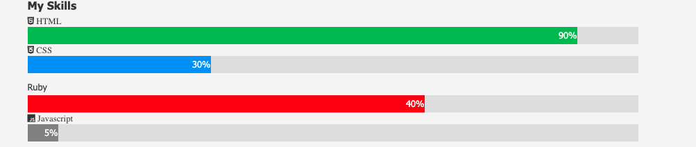

### 4. Download button

Download button is added in the About me page. By clicking the download button potential employer will be able to download my PDF copy of CV. 

It is in the buttom of the page and has also hover effect to show it is clickable. The link is large, bolded and has download image in the button. 

### 5. Shadow effect in the Project page

To show all the projects that I have done so far, shadow effect is used for the boxes in the project page. This makes the boxes more distinct from rest of the page. Also, to go to the actual project in the Github, the whole image and the headings are made clickable, which is linked to the actual Github website.

### 6. Contact page changing hover effect

In the contact page, when the the visitors will hover over the email address, mobile number or social page, it will not only hover but also the box size will change. The color of the text will also change while hovering. This will keep user more interested in the page. Big bold hover effect is used with blue colors. 

### 7. Social page icons

For potential employer or visitors to link with me or know more about me, social page icons are used. The icons have hover effect and will change color when hovered. These icons will link to my actual social pages. The icons are used in Landing page and contact page.
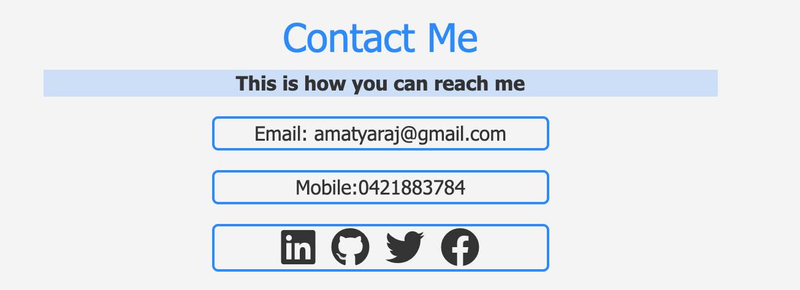

### Other features

- ### Responsive Design

  As visitors to the site may use a different type of devices, the website has been designed to function well on screens of different sizes.

  This has been accomplished by the use of CSS Flexbox, which allows control over the positioning of elements in response to a change in screen size. The website is designed to display correctly on a device as small as an iPhone 5/SE. A media break point was set to 'min-width: 768px' to achieve certain effects on browsers. For example pages like blogs and projects will have 2 rows layout in laptop and desktop version or bigger screen. However;  as the screen goes smaller it will change into single column and all the images and boxes will stack in top of each other. This will give better user experience to the user and flexibility to use the website in different screens. 

  Another example of responsive design is in the Landing page, where the desktop view does not have my profile pic for the look of the page. However as you go below 768px, profile pic will emerge. This suites the look and feel of the page in different screen.

  

- ### Accessibility

  The website is build by keeping visually-impaired users in mind. A proper meaningful description is used in the alt-text for any images on the page.  Color contrast between the elements is high by generally using two contrast colors and background color for the page is light . This will give the contrast between the important elements. 

  

- ### Semantic HTML

  Semantic HTML element is used for better reading and understanding of the code. tags such as Header, Section, Nabvar, Footer, Main  have been used and comments have been added to the HTML document.

  Also, the classes and id's used in CSS are named in such a way that it relates to the actual intention of the code. Such as box, container are used.

  

- ### Three version

  Three versions of the website have been produced and saved on different branches in Github. These versions are:

  - 'master' branch with the base version
- 'Navbar' created in the seperate branch and merged to master branch
  - 'background-color' in the seperate branch created with different color.

  ​	

  The branch version can be visited by typing: branch checkout branch  name in the terminal.

  For example to check the navbar in the branch type: branch checkout navbar.

  

- ### Subresource integrity

  It is to  make sure that the files delivered to your web application do not have any unexpected malicious code by a third party.

  Since subresource integrity is very important, it is achieved by creating a hash using sha512 and using it in our link tags in HTML. This is to make sure that page will only load with styles if it is identical to its state when the sha512 hash was created. Any changes made in the page, the HTML page will load without CSS styling.

  

## Sitemap

The website simply has all pages link to each other via the navigation bar. So user can navigate to any pages from anywhere.  A sitemap for the website is presented below:

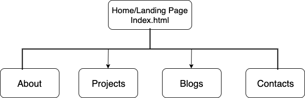

### Design brief

#### Pinterest

Pinterest was used to get the design and color ideas.

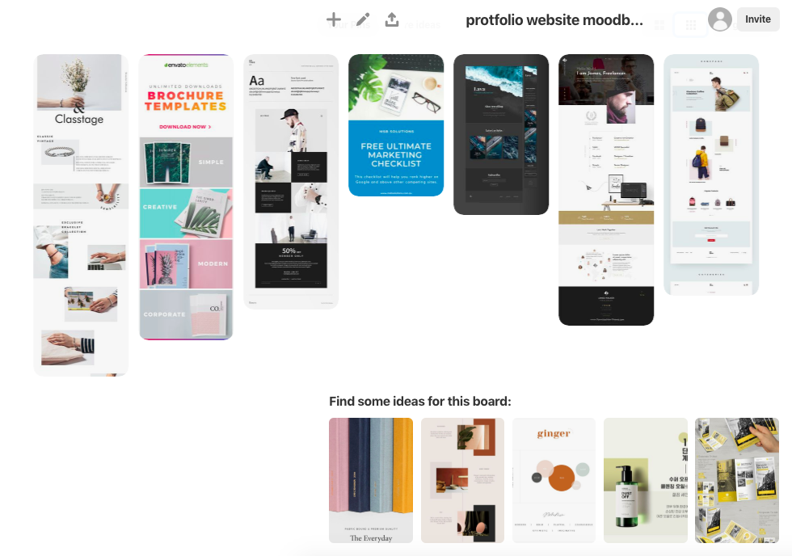

#### Wireframe

Wireframe for the website was created in the initial state of designing. Wireframes were designed keeping mobile view in mind.

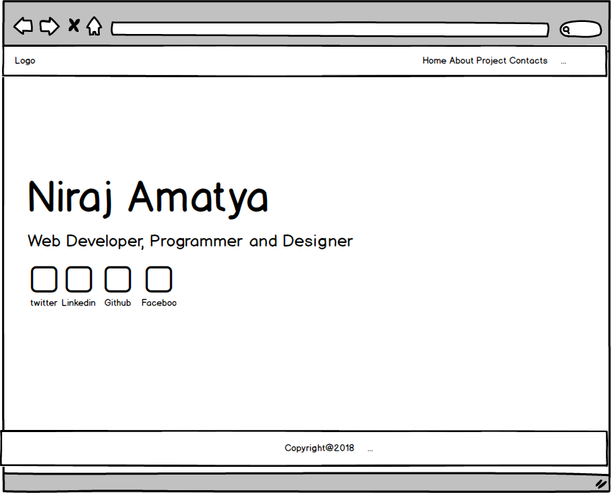
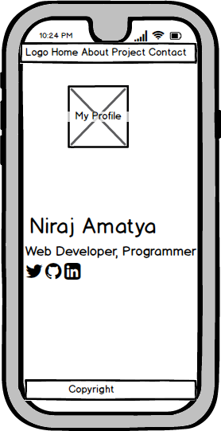

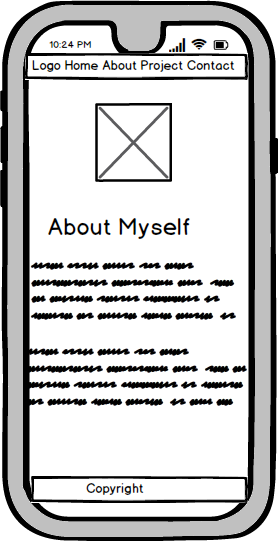

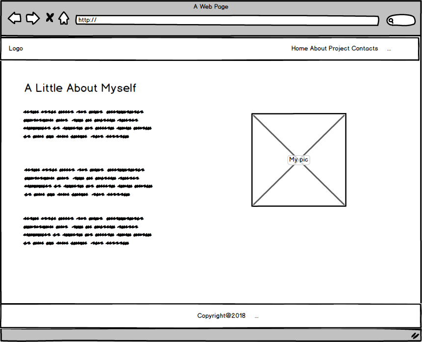
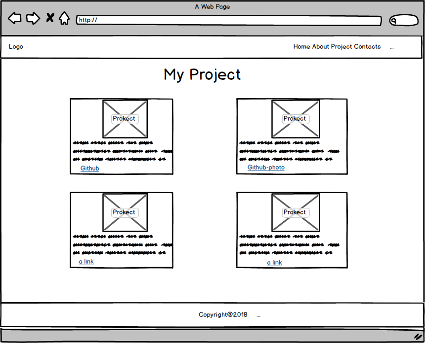
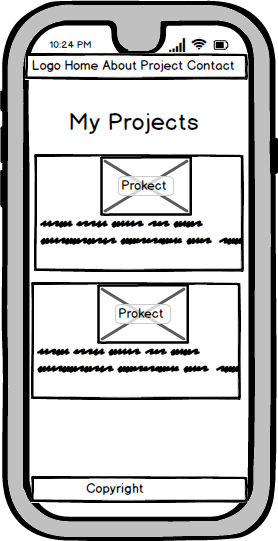
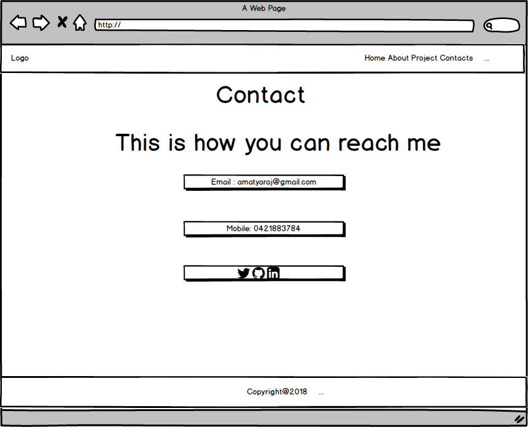
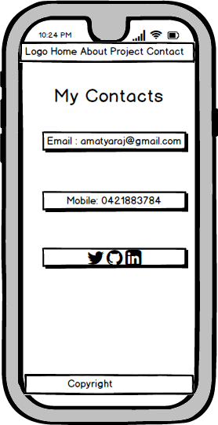

### Trello

Trello was used to track the progress of the website and to distinguish the priority.

[Trello](https://trello.com/b/00dnHOP4/protfolio-website)

6/12/2019 -5pm
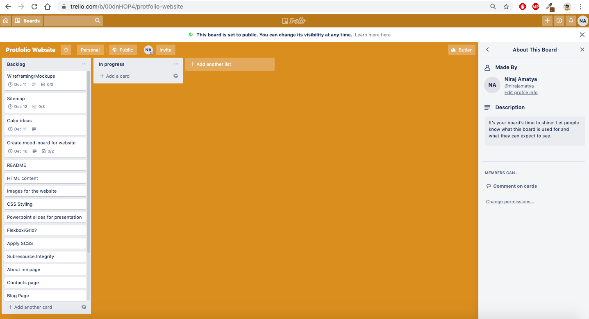

7/12/2019- 3pm
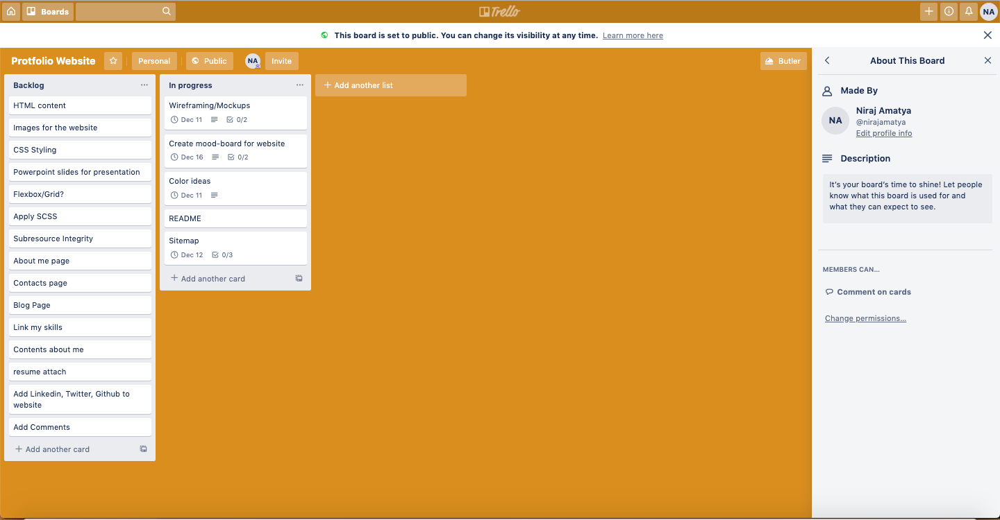

9/12/2019- 4:30pm
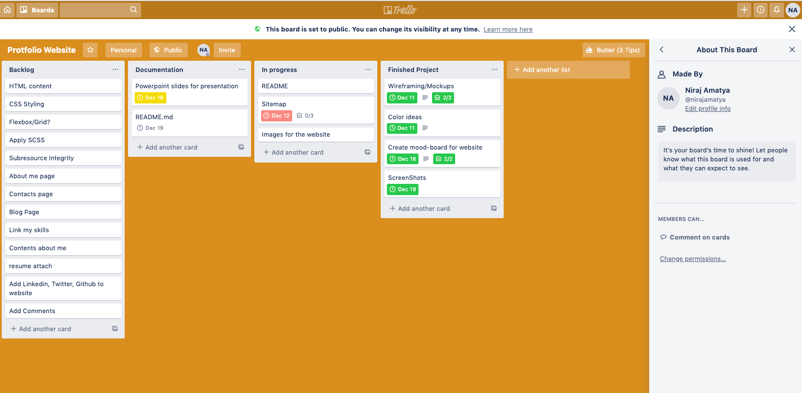

12/12/2019- 5:12pm
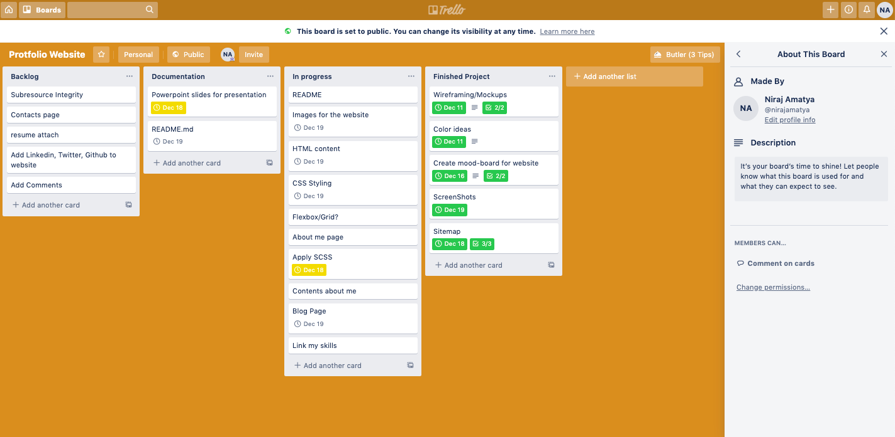

15/12/2019- 7pm
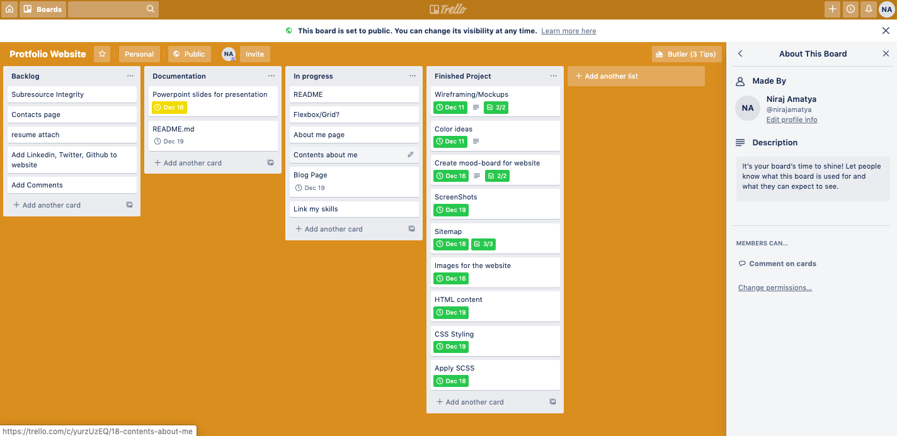

17/12/2019- 11:30pm
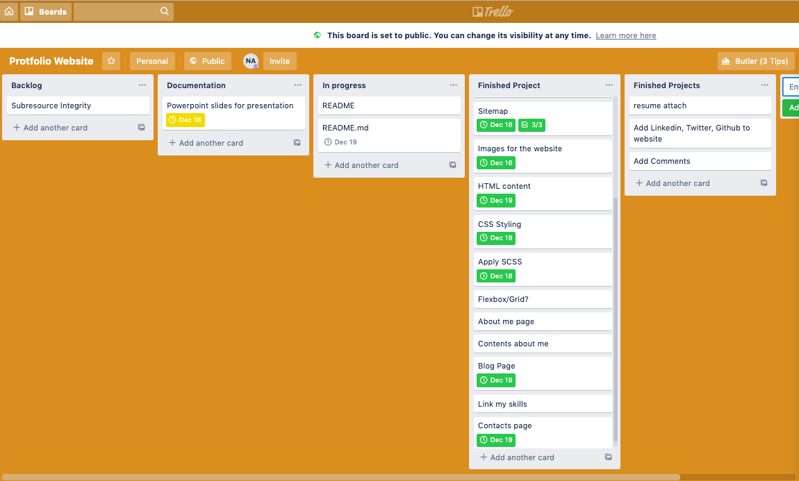

19/12/2019 7:45am
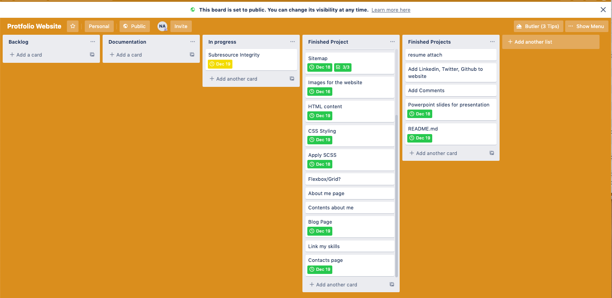

#### Website Screenshots

Landing page Desktop 
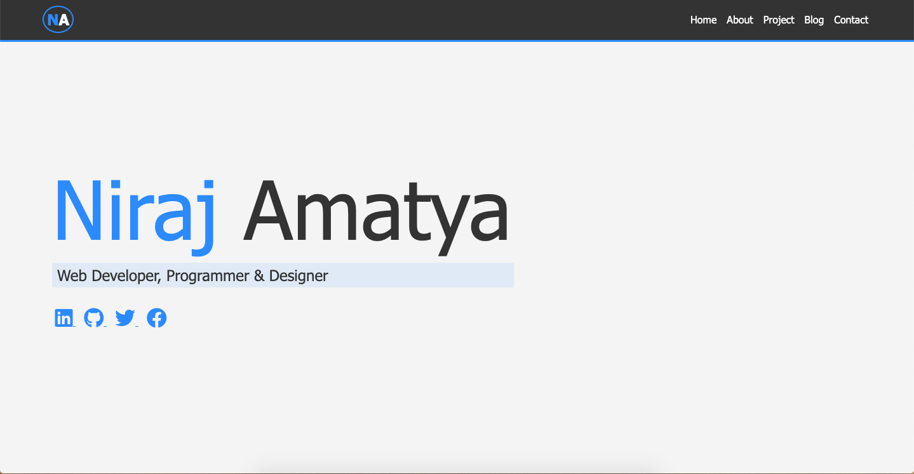

Mobile
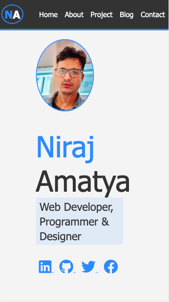

Ipad
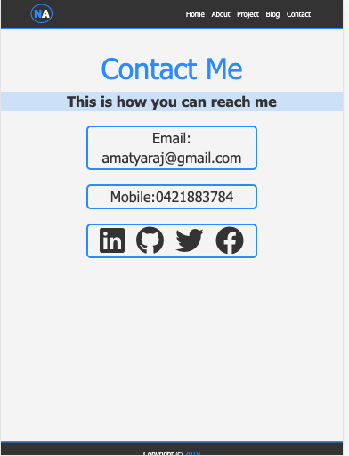

Project desktop
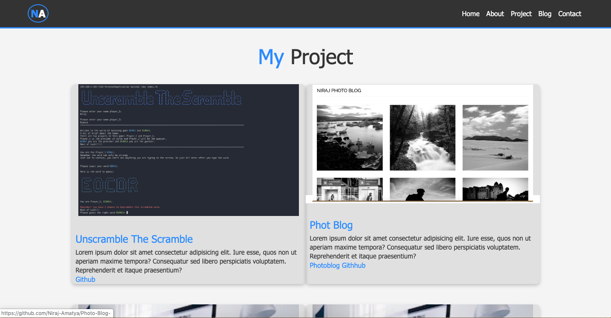

Ipad
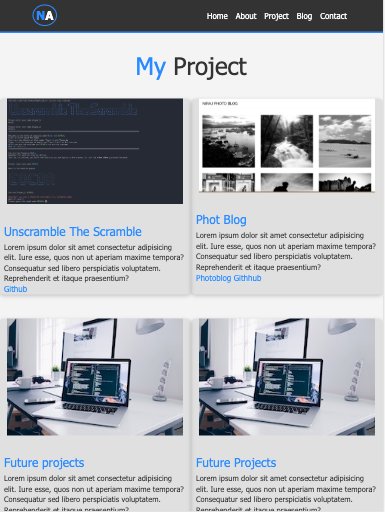

Mobile
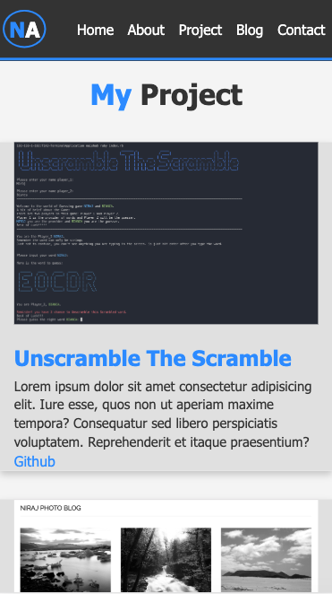

### Target Audience

- Potential employers and recruiting agencies
- Educators and devs
- Family, friends and relatives
- Businesses

### Technology Stack

- Programming languages: HTML, CSS, SASS
- Source control: git & GitHub
- Planning & implementation: 1. project management (Trello), 2. mood board (Pinterest), 3. wireframe (Balsamiq)
- Deployment platform: Github
- Subresource Integrity hash: sha-512

------

### Future Improvements

- Adding an collapsable menu bar when screen goes small
- Designing personal logo for branding
- More Images
- Learn grid and create more meaningful design

